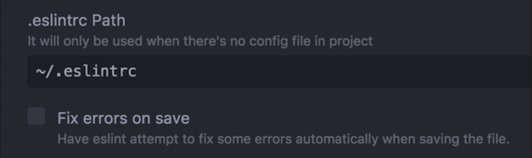

# @improntaadvance/eslint-config

An ESLint Shareable Config from ImprontaAdvance based on config-react-app.

This module is for advanced users.

### Installation for projects based on [create-react-app](https://create-react-app.dev/)

```sh
$ npm install --save-dev @improntaadvance/eslint-config
# OR
$ yarn add --dev @improntaadvance/eslint-config
```


### Installation for projects not based on [create-react-app](https://create-react-app.dev/)

```sh
$ npm install --save-dev @improntaadvance/eslint-config
# OR
$ yarn add --dev @improntaadvance/eslint-config
```

Then, install peerDependencies:

```sh
$ npx install-peerdeps -d eslint-config-react-app@7
```

## Usage

In your ESlint configuration file (either `.eslintrc`, `.eslintrc.js` or the `eslintConfig` property in your `package.json`) add the following fields:

```json
{
  "extends": ["@improntaadvance"]
}
```

You can append the `"@improntaadvance"` value if you're having other configs already.


## Using Prettier

Because the [`prettier`](https://github.com/prettier/prettier) configuration is already integrated in this configuration you can just execute `eslint --fix` as usual to apply prettier style to your code:

```sh
$ ./node_modules/.bin/eslint --fix
// or if you have it globally installed
$ eslint --fix
```

However it may be useful to have a handy script to call for that, together with other awesome `fix` `eslint` provides.
Therefore in your `package.json` file just add in the `scripts` section:

```json
...
"scripts": {
  ...
  "eslint:fix": "eslint --fix"
}
```

## IDE Integration

Integrating this with your editor will check your code during development together with automatically fix many issues on save. Most issues may arise from the `prettier` rules inside this package, that `eslint --fix` can easily solve for you.

### VSCode

Install a `eslint` extension and enable the `eslint --fix` on save in the IDE preferences:

```
...

"eslint.autoFixOnSave": true,
...
```

### Atom

Install a `eslint` plugin and enable from the extension configuration the label :



## Override the prettier configuration

Sometimes it is required to tweak a little bit the configuration, expecially when working with different teams one may like 2 ore 4 spaces indentation.
This request is reasonable and it is possible to tweak the configuration directly in the `eslint` configuration file:

```json
{
  "extends": [
    "@improntaadvance"
  ],
  "rules": {
    "prettier/prettier": [
      "error",
      {
        "singleQuote": true,
        "trailingComma": "es5",
        "bracketSpacing": false,
        "jsxBracketSameLine": true,
        "parser": "flow",
        "tabWidth": 2
      }
    ]
  }
}
```

Note that the whole configuration object needs to be passed.

### Integration with Third party tools

As an alternative for overriding it is possible to keep distinct the `prettier` configuration to better integrate with third party tools and use a `.prettierrc` file.

* Create a `.prettierrc` file and paste the following content inside:

```js
{
  singleQuote: true,
  trailingComma: 'es5',
  bracketSpacing: false,
  jsxBracketSameLine: true,
  parser: 'flow',
  tabWidth: 4,
}
```

* Now edit your `.eslintrc` file and add the following rule:

```json
{
  "extends": [
    "@improntaadvance"
  ],
  "rules": {
    "prettier/prettier": [
      "error",
      null
    ]
  }
}
```

Now everything should be in sync: edit the `.prettierrc` file with your own custom rules.

## Common issues

### The IDE prettier plugin does not read this configuration

This module works using only the `eslint` plugin for IDEs. Additional prettier plugins may go in conflict with this configuration as they usually rely only on the `.prettierrc` configuration file.
It is possible to make them both work overriding the current configuration as explained in the [third party tools section][#integration-with-third-party-tools].

## Badge

```
[](http://improntaadv.com/)
```

[](http://improntaadv.com/)
